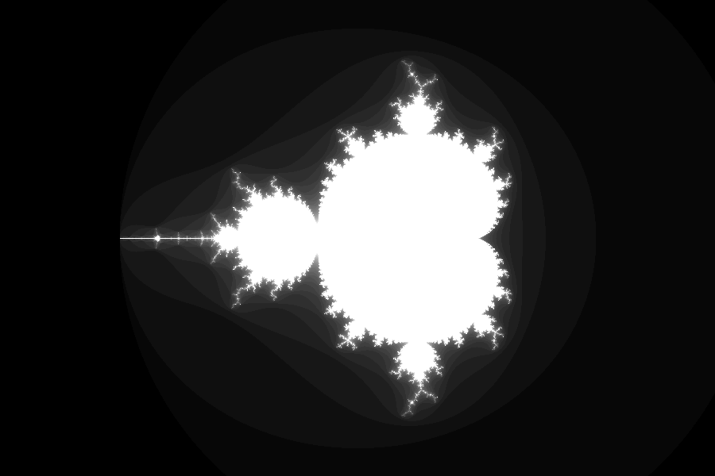

# MandElmBrot

Generating the Mandelbrot Set using [Elm](https://elm-lang.org).

Computing the Set is elegant in Elm, but showing the Image is not.

The current implementation uses [Elm-Image](https://package.elm-lang.org/packages/justgook/elm-image/latest/) to save the bitmap as a PNG file which is then loaded by the web browser. This is a very ineffective solution, and a better one would be to set pixels straight into a Canvas, but as far as I know this is not possible with Elm. There is no way either no efficient way to pass a bitmap from Elm to JavaScript so it could write to a canvas.

I stopped working on it because it seems to be undoable in Elm. I could compute some parameters and let JavaScript draw the Set, but that would defeat the whole purpose of my experiment.

